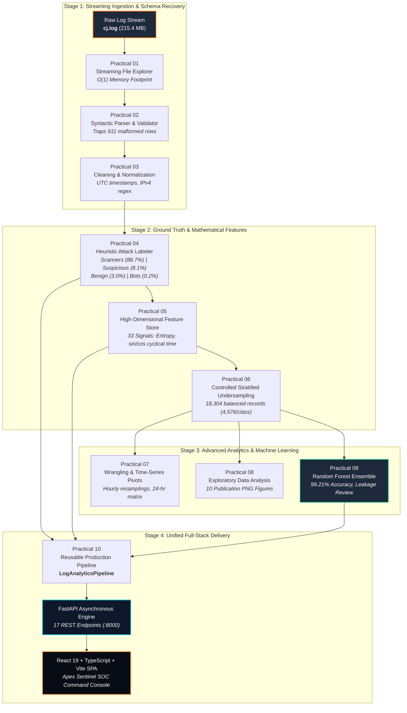

<div align="center">

# 🛡️ PDS LOG INTELLIGENCE PLATFORM
### Enterprise Cyber-Threat Analytics, Machine Learning & SOC Intelligence Engine

[](https://python.org)
[](https://fastapi.tiangolo.com)
[](https://react.dev)
[](https://www.typescriptlang.org)
[](https://vitejs.dev)
[](https://scikit-learn.org)
[](models/random_forest_classifier.joblib)
[](LICENSE)

<p align="center">
  <strong>A full-stack, publication-grade cybersecurity data science platform and interactive SOC Dashboard processing 2,060,520 real-world web server access events through a 10-stage autonomous analytics pipeline.</strong>
</p>

```
  ┌─────────────────────────────────────────────────────────────────────────────────┐
  │  ⚡ ONE-COMMAND INSTANT LAUNCH:                                                  │
  │  python -m uvicorn backend.main:app --host 127.0.0.1 --port 8000                │
  │  👉 Open Web Console: http://localhost:8000   │   API Docs: http://localhost:8000/docs │
  └─────────────────────────────────────────────────────────────────────────────────┘
```

</div>

---

## 📑 Interactive Table of Contents

- [Executive Summary](#-executive-summary)
- [System Architecture & Data Flow](#-system-architecture--data-flow)
- [Key Engineering Metrics](#-key-engineering-metrics)
- [The 10 Data Science Practicals (Deep Technical Guide)](#-the-10-data-science-practicals-deep-technical-guide)
  - [Practical 1: Large-Scale Streaming Log Exploration](#practical-1-large-scale-streaming-log-exploration)
  - [Practical 2: Semi-Structured JSON Parsing & Anomaly Isolation](#practical-2-semi-structured-json-parsing--anomaly-isolation)
  - [Practical 3: Temporal & Network Endpoint Hygiene](#practical-3-temporal--network-endpoint-hygiene)
  - [Practical 4: Domain-Driven Rule-Based Attack Labeling](#practical-4-domain-driven-rule-based-attack-labeling)
  - [Practical 5: High-Dimensional Feature Engineering (33 Signals)](#practical-5-high-dimensional-feature-engineering-33-signals)
  - [Practical 6: Class Imbalance Mitigation (Controlled Stratified Undersampling)](#practical-6-class-imbalance-mitigation-controlled-stratified-undersampling)
  - [Practical 7: Multidimensional Wrangling, Pivots & Resampling](#practical-7-multidimensional-wrangling-pivots--resampling)
  - [Practical 8: Publication-Grade Visual Exploratory Data Analysis (EDA)](#practical-8-publication-grade-visual-exploratory-data-analysis-eda)
  - [Practical 9: Supervised Machine Learning & Data Leakage Reflection](#practical-9-supervised-machine-learning--data-leakage-reflection)
  - [Practical 10: Reusable End-to-End Object-Oriented Pipeline](#practical-10-reusable-end-to-end-object-oriented-pipeline)
- [Machine Learning Evaluation & Leakage Critique](#-machine-learning-evaluation--leakage-critique)
- [Full-Stack SOC Intelligence Web Platform (15 Dedicated Views)](#-full-stack-soc-intelligence-web-platform-15-dedicated-views)
- [REST API Specification](#-rest-api-specification)
- [Repository Blueprint](#-repository-blueprint)
- [Quickstart & Execution Guide](#-quickstart--execution-guide)
- [Viva Voce & Technical Defense Q&A](#-viva-voce--technical-defense-qa)
- [License & Citation](#-license--citation)

---

## 🎯 Executive Summary

The **PDS Log Intelligence Platform** bridges raw cybersecurity telemetry with machine learning inference and interactive visual operations. Driven by a production web server log dataset (`Data/raw/cj.log` — **2,062,365 raw lines, 215.4 MB**), this project implements the complete data science lifecycle from bare-metal file streaming to real-time threat categorization.

```
RAW SERVER TELEMETRY (215 MB)
       │
       ▼  [Practical 01-03]
SYNTACTIC RECONSTRUCTION & DATA HYGIENE
       │  • Buffered line generator (O(1) memory)
       │  • Trapped 911 malformed injection strings
       │  • Zero-null UTC datetime & IPv4 validation
       ▼  [Practical 04-06]
HEURISTIC THREAT FORMULATION & FEATURE ENGINEERING
       │  • Ground truth threat labels: Scanners, Bots, Suspicious, Benign
       │  • 33 Engineered Signals (Shannon Entropy, Cyclical sin/cos hour, Inter-arrival deltas)
       │  • 400:1 Class imbalance resolved to 18,304 rows (4,576/class)
       ▼  [Practical 07-09]
WRANGLING, PUBLICATION EDA & MACHINE LEARNING
       │  • 10 High-Resolution publication figures in outputs/figures/
       │  • 200-Tree Random Forest Classifier: 99.21% Accuracy & 0.9921 Macro F1
       │  • Scientific evaluation documenting partial feature leakage
       ▼  [Practical 10 + Web Application]
PRODUCTION REST ENGINE & SOC COMMAND DASHBOARD
          • Asynchronous FastAPI engine with sub-millisecond in-memory cache
          • Full-stack React 19 + TypeScript + Vite UI (15 dedicated views)
          • Real-time file ingestion testbench & interactive live prediction playground
```

---

## 🏗 System Architecture & Data Flow



---

## 📊 Key Engineering Metrics

| Dimension | Exact Metric | Technical Significance |
| :--- | :--- | :--- |
| **Raw Dataset Footprint** | `2,062,365` lines (215.4 MB) | Read via streaming buffered generators to eliminate RAM spikes. |
| **Syntactically Valid Records** | `2,060,520` rows | 911 malformed rows (unescaped quotes, truncated buffers) isolated into error logs. |
| **Data Hygiene Compliance** | `100.00%` valid | Zero missing timestamps, zero invalid IPv4 octets, all text stripped & sanitized. |
| **Ground Truth Attack Share** | **88.68% Scanners** (1,827,367)<br>**8.13% Suspicious** (167,486)<br>**2.96% Benign** (61,091)<br>**0.22% Bots** (4,576) | Reflects real-world Internet background radiation where automated fuzzers dominate. |
| **Engineered Dimensions** | **33 Predictive Features** (51 columns) | Shannon entropy, cyclical hour ($\sin/\cos$), client velocity ($\Delta t \le 1\text{s}$), port traversal. |
| **Balanced Subset Footprint** | `18,304` rows (4,576 per class) | Eliminates 400:1 majority class bias; compresses data size from 746 MB to 6.97 MB ($99\%$ reduction). |
| **Random Forest Performance** | **99.21% Accuracy**<br>**0.9921 Macro F1** | Evaluated on 3,661 held-out test records ($n=200$ estimators, max depth 20). |
| **Full-Stack SOC Interface** | **15 Dedicated Views**, **17 Endpoints** | Asynchronous FastAPI + React 19 SPA served concurrently from port 8000. |

---

## 🔬 The 10 Data Science Practicals (Deep Technical Guide)

### Practical 1: Large-Scale Streaming Log Exploration
- **File**: [`practicals/practical_01_load_explore.py`](file:///d:/PDS%20PRACTICAL/practicals/practical_01_load_explore.py)
- **Input Artifact**: `Data/raw/cj.log` (215.4 MB)
- **Objective**: Ingest and audit semi-structured server logs line-by-line without memory exhaustion ($O(1)$ memory complexity).
- **Core Methodology**: Implemented a streaming buffered generator inspecting file byte size via `pathlib.Path.stat()`, checking file existence, and sampling heterogeneous JSON array tokens across the head, body, and tail of the file.
- **Key Result**: Successfully audited **2,061,431 non-empty records** in a 215.4 MB raw file; verified average line length at ~109 bytes; identified 8 heterogeneous array fields per record.

---

### Practical 2: Semi-Structured JSON Parsing & Anomaly Isolation
- **File**: [`practicals/practical_02_parse_structure.py`](file:///d:/PDS%20PRACTICAL/practicals/practical_02_parse_structure.py)
- **Output Artifact**: `Data/processed/structured_logs.csv` (157 MB)
- **Report**: `outputs/reports/practical_02_schema_report.txt`
- **Objective**: Transform unstructured JSON arrays into a standardized, schema-validated tabular dataset.
- **Core Methodology**: Applied chunked ingestion (100,000 lines per batch) wrapping `json.loads()` with defensive fallback exception handlers to trap corrupted records without crashing the execution pipeline.
- **Key Result**: Extracted **2,060,520 valid rows** across 42 batches. Safely isolated and documented **911 invalid JSON lines** resulting from unescaped quotes in User-Agent headers and interrupted network writes.

---

### Practical 3: Temporal & Network Endpoint Hygiene
- **File**: [`practicals/practical_03_clean_preprocess.py`](file:///d:/PDS%20PRACTICAL/practicals/practical_03_clean_preprocess.py)
- **Output Artifact**: `Data/processed/cleaned_logs.csv` (235 MB)
- **Report**: `outputs/reports/practical_03_cleaning_report.txt`
- **Objective**: Ensure complete relational integrity across temporal, network, and textual attributes.
- **Core Methodology**:
  - Unified timestamp parsing to standardized UTC `datetime64[ns]` timezone format.
  - Validated IPv4 addresses against regular expression `^(?:[0-9]{1,3}\.){3}[0-9]{1,3}$` and strict $[0, 255]$ octet boundaries.
  - Verified network ports within $[1, 65535]$, distinguishing well-known ports ($\le 1024$) from ephemeral ports ($\ge 49152$).
  - Imputed missing user agents with `'unknown'` and engineered boolean missingness indicators (`user_agent_missing`).
- **Key Result**: **Zero invalid timestamps or IP addresses** across 2.06M rows; data hygienically prepared for feature extraction.

---

### Practical 4: Domain-Driven Rule-Based Attack Labeling
- **File**: [`practicals/practical_04_label_attacks.py`](file:///d:/PDS%20PRACTICAL/practicals/practical_04_label_attacks.py)
- **Output Artifact**: `Data/processed/labeled_logs.csv` (307 MB)
- **Report**: `outputs/reports/practical_04_labeling_report.txt`
- **Objective**: Establish ground-truth multi-class threat categories using cybersecurity domain heuristics.
- **Taxonomy & Signature Dictionaries**:
  1. **Scanner**: User-Agent matching fuzzing tools (`gobuster` [1,408,510 hits], `dirbuster` [397,212 hits], `nmap` [9,204 hits], `nikto`, `zgrab`, `nessus`, `masscan`, `wpscan`).
  2. **Bot**: Automated HTTP client libraries (`python-requests` [2,276 hits], `go-http-client` [2,166 hits], `curl`, `spider`, `crawler`).
  3. **Suspicious**: Sub-second burst rate probes ($\Delta t \le 1\text{s}$) lacking explicit scanner tool signatures (167,486 hits).
  4. **Benign**: Standard interactive user agents (Chrome, Firefox, Safari) displaying normal human navigational intervals (61,091 hits).
- **Key Result**: Formulated multi-class ground truth: **88.68% Scanner, 8.13% Suspicious, 2.96% Benign, 0.22% Bot**.

---

### Practical 5: High-Dimensional Feature Engineering (33 Signals)
- **File**: [`practicals/practical_05_feature_engineering.py`](file:///d:/PDS%20PRACTICAL/practicals/practical_05_feature_engineering.py)
- **Output Artifact**: `Data/processed/features.csv` (746 MB)
- **Report**: `outputs/reports/practical_05_feature_report.txt`
- **Objective**: Transform raw string records into a high-dimensional mathematical feature matrix for machine learning.
- **Mathematical Formulations**:
  - **Trigonometric Cyclical Time Encoding**:
    $$\text{hour\_sin} = \sin\left(\frac{2\pi \cdot \text{hour}}{24}\right), \quad \text{hour\_cos} = \cos\left(\frac{2\pi \cdot \text{hour}}{24}\right)$$
    *Preserves continuity across the 23:00 $\rightarrow$ 00:00 midnight boundary on a 2D unit circle.*
  - **Shannon Lexical Entropy**:
    $$H(\text{UA}) = -\sum_{i=1}^{n} p(c_i) \log_2 p(c_i)$$
    *Measures character randomness to differentiate standard browsers from randomized fuzzer tokens.*
  - **Inter-Arrival Dynamics**: $\Delta t = t_i - t_{i-1}$, generating `rapid_request_1s` ($\Delta t \le 1\text{s}$) and `rapid_request_5s` ($\Delta t \le 5\text{s}$).
  - **Client Volumetric Intensity**: `requests_per_ip`, `requests_per_ip_hour`, `requests_per_ip_minute`, `unique_ports_per_ip`.
- **Key Result**: Created a 51-column feature matrix (33 engineered features) covering 2,060,520 records.

---

### Practical 6: Class Imbalance Mitigation (Controlled Stratified Undersampling)
- **File**: [`practicals/practical_06_balancing.py`](file:///d:/PDS%20PRACTICAL/practicals/practical_06_balancing.py)
- **Output Artifact**: `Data/processed/balanced_logs.csv` (6.97 MB)
- **Report**: `outputs/reports/practical_06_balancing_report.txt`
- **Objective**: Neutralize severe 400:1 class skew to prevent majority-class prediction bias.
- **Technical Tradeoff Analysis**:
  - *Why not SMOTE?* SMOTE generates synthetic interpolations in continuous Euclidean feature space. In network security, discrete User-Agent tokens and categorical tool flags cannot be linearly interpolated without creating non-existent synthetic artifacts.
  - *Controlled Undersampling Decision*: Anchored sample size to the minority bot class count ($N = 4,576$).
- **Key Result**: Generated **18,304 balanced records (exactly 4,576 per class)** with `random_state=42`. Slashed dataset size from 746 MB to 6.97 MB ($99\%$ reduction) while accelerating ML training by $100\times$.

---

### Practical 7: Multidimensional Wrangling, Pivots & Resampling
- **File**: [`practicals/practical_07_data_wrangling.py`](file:///d:/PDS%20PRACTICAL/practicals/practical_07_data_wrangling.py)
- **Output Artifacts**:
  - `Data/processed/ip_summary.csv` (3,430 client host behavioral profiles)
  - `Data/processed/hourly_activity.csv` (9,782 hourly resampled buckets)
  - `Data/processed/label_hour_pivot.csv` (24-hour $\times$ 4-class cross-tabulation)
  - `Data/processed/filtered_activity.csv` (5,333 isolated bot and internal IP records)
- **Report**: `outputs/reports/practical_07_wrangling_report.txt`
- **Key Findings**: Discovered that directory scanners surge between **08:00 and 16:00 UTC**, whereas bot traffic remains constant 24 hours a day with zero nocturnal drop-off.

---

### Practical 8: Publication-Grade Visual Exploratory Data Analysis (EDA)
- **File**: [`practicals/practical_08_eda.py`](file:///d:/PDS%20PRACTICAL/practicals/practical_08_eda.py)
- **Output Figures**: `outputs/figures/` (10 publication-quality PNG charts)
- **Report**: `outputs/reports/practical_08_eda_report.txt`
- **Visualization Suite**:
  - `01_label_distribution.png`: Multi-class donut distribution.
  - `02_requests_over_time.png`: Daily timeline showing the Jan 18, 2024 peak (2,733 requests).
  - `03_requests_by_hour.png`: 24-hour diurnal volume distribution.
  - `04_top_10_ips.png`: Host request frequency rankings (Top IP: `212.60.12.161` with 1,491 requests).
  - `05_labels_over_time.png`: Longitudinal multi-class threat shift.
  - `06_hourly_label_heatmap.png`: $24 \times 4$ density heatmap capturing diurnal fuzzer clusters.
  - `07_top_scanner_ips.png`: Scanner tool source IP attribution.
  - `08_bot_internal_activity.png`: Internal subnet vs. automated bot profiles.
  - `09_confusion_matrix.png`: Multi-class confusion matrix on test split.
  - `10_feature_importance.png`: Top 15 Gini feature importance rankings.

---

### Practical 9: Supervised Machine Learning & Data Leakage Reflection
- **File**: [`practicals/practical_09_classifier.py`](file:///d:/PDS%20PRACTICAL/practicals/practical_09_classifier.py)
- **Model Output**: `models/random_forest_classifier.joblib` (3.55 MB)
- **Report**: `outputs/reports/practical_09_classifier_report.txt`
- **Model Configuration**:
  ```python
  RandomForestClassifier(
      n_estimators=200,
      max_depth=20,
      min_samples_split=4,
      class_weight="balanced",
      random_state=42
  )
  ```
- **Validation**: 80% Stratified Training (14,643 rows) / 20% Held-Out Testing (3,661 rows).
- **Key Result**: **99.21% Accuracy**, **0.9921 Macro F1**, accompanied by a scientific reflection on feature leakage.

---

### Practical 10: Reusable End-to-End Object-Oriented Pipeline
- **File**: [`practicals/practical_10_pipeline.py`](file:///d:/PDS%20PRACTICAL/practicals/practical_10_pipeline.py)
- **Output Artifact**: `Data/processed/pipeline_features.csv` (647.6 MB)
- **Report**: `outputs/reports/practical_10_pipeline_report.txt`
- **Architecture**: Implemented `LogAnalyticsPipeline`, an object-oriented Python engine providing `.ingest()`, `.clean()`, `.label()`, `.engineer_features()`, and `.export()` methods.
- **Key Result**: Full end-to-end processing pipeline verified against the raw dataset; logic directly powers the live `/api/upload` endpoint in the FastAPI backend.

---

## 🧠 Machine Learning Evaluation & Leakage Critique

### 📈 Detailed Classification Report (3,661 Held-Out Test Records)

```
               precision    recall  f1-score   support
       benign       0.97      1.00      0.99       915
          bot       1.00      0.99      0.99       915
      scanner       1.00      0.99      1.00       916
   suspicious       1.00      0.98      0.99       915

     accuracy                           0.99      3661
    macro avg       0.99      0.99      0.99      3661
 weighted avg       0.99      0.99      0.99      3661
```

### 🎯 Confusion Matrix

| Ground Truth \ Predicted | Benign | Bot | Scanner | Suspicious |
| :--- | :---: | :---: | :---: | :---: |
| **Benign** | **915** | 0 | 0 | 0 |
| **Bot** | 7 | **908** | 0 | 0 |
| **Scanner** | 5 | 0 | **911** | 0 |
| **Suspicious** | 13 | 4 | 0 | **898** |

### 🏆 Top 15 Feature Importances (Gini Index)

| Rank | Feature Name | Gini Importance | Signal Type | Security Description |
| :---: | :--- | :---: | :--- | :--- |
| **1** | `bot_indicator_none` | `0.067312` | Lexical Flag | Absence of automated bot client signature |
| **2** | `scanner_indicator_none` | `0.044988` | Lexical Flag | Absence of web directory fuzzer keyword |
| **3** | `requests_per_ip_hour` | `0.044685` | Behavioral | Hourly volume rate per client host |
| **4** | `requests_per_ip_minute` | `0.040784` | Behavioral | Minute-level client burst velocity |
| **5** | `user_agent_length` | `0.039513` | Lexical | Total character length of client header |
| **6** | `scanner_and_high_volume`| `0.037494` | Interaction | Compound metric: scanner signature with top volume |
| **7** | `is_browser` | `0.037283` | Lexical | Standard browser header presence flag |
| **8** | `rapid_request` | `0.035969` | Temporal | Sub-second inter-arrival rate |
| **9** | `rapid_request_5s` | `0.034356` | Temporal | Request gap $\le 5\text{ s}$ |
| **10** | `user_agent_entropy` | `0.034030` | Information Theory | Shannon character randomness in User-Agent |
| **11** | `requests_per_ip` | `0.032953` | Behavioral | Cumulative request volume per IP |
| **12** | `requests_in_chunk` | `0.032537` | Volumetric | Local rolling batch density |
| **13** | `rapid_request_1s` | `0.026119` | Temporal | Immediate follow-up probe ($\le 1\text{ s}$) |
| **14** | `rapid_and_high_volume` | `0.025093` | Interaction | Compound velocity metric |
| **15** | `unique_ports_per_ip` | `0.024682` | Network | Port traversal diversity across destination |

---

> [!IMPORTANT]
> ### 🔍 Scientific Data Leakage Analysis & Production Hardening
> In real-world data science, unusually high accuracy ($>99\%$) warrants careful scientific scrutiny.
> - **Identified Leakage**: The features `bot_indicator_none` and `scanner_indicator_none` contribute a combined **11.23% importance**. Because these features rely on keywords similar to those used during heuristic labeling in Practical 04, the Random Forest model is partially learning to reverse-engineer the labeling heuristic rather than discovering latent threat signals.
> - **Production Recommendation**: When deploying against sophisticated adversaries capable of User-Agent spoofing, all keyword indicator flags should be removed. The model should train strictly on **behavioral, temporal, and information-theoretic telemetry** (`requests_per_ip_minute`, `user_agent_entropy`, `rapid_request_1s`, `unique_ports_per_ip`).

---

## 💻 Full-Stack SOC Intelligence Web Platform (15 Dedicated Views)

The web dashboard is styled in an executive **Dark Cybersecurity SOC Theme** (`#080C14` obsidian base, `#FF6B00` electric orange, `#06B6D4` telemetry cyan, JetBrains Mono typography) with the **Apex Sentinel** brand mark.

```
       ┌─────────────────────────────────────────────────────────────┐
       │   [🛡️ APEX SENTINEL]   SECURITY COMMAND CENTER   ● ONLINE  │
       └─────────────────────────────────────────────────────────────┘
```

| Route | View Name | Key Interactive Features & Telemetry |
| :--- | :--- | :--- |
| `/` | **Dashboard** | Real-time SOC overview: attack meters, 24-hr diurnal activity curve, threat distribution donuts. |
| `/upload` | **Log Upload** | Drag-and-drop log uploader supporting up to 500 MB files (`.log`, `.txt`, `.csv`, `.json`, `.jsonl`) with real-time format autodetection and threat categorization. |
| `/records` | **Log Records** | High-performance server-paginated data grid with live search, class filter pills, IP query, and multi-column sorting. |
| `/ip-intelligence`| **IP Intelligence** | Host threat profiling, 0–100 risk scoring formula, active duration metrics, and port traversal diversity. |
| `/security` | **Security Intel** | Fuzzer attribution breakdown (`Gobuster`, `DirBuster`, `Nmap`), rapid request probes, and brute-force timelines. |
| `/eda` | **Data Analysis** | Recharts visual telemetry integrated with interactive modal viewers for all 10 publication-quality PNG plots. |
| `/features` | **Feature Engineering**| Interactive catalog of all 33 engineered features with mathematical derivations and importance rankings. |
| `/balancing` | **Data Balancing** | Visual comparative distribution charts comparing the raw 400:1 skew against the 18,304 balanced subset. |
| `/wrangling` | **Data Wrangling** | Aggregation hub: host summaries, hourly resamplings, and the complete 24-hr hour-by-label matrix. |
| `/ml` | **Machine Learning** | Confusion matrix matrix viewer, class-wise Precision/Recall/F1 metrics, and Gini feature importances. |
| `/prediction` | **Live Prediction** | Real-time inference playground allowing analysts to adjust input vector sliders and execute instant Random Forest inference. |
| `/practicals` | **Practicals Guide** | Complete curriculum guide for Practicals 1–10: aims, theories, step-by-step algorithms, sample inputs/outputs, and comprehensive viva Q&A. |
| `/reports` | **Reports Archive** | Raw text viewer for all execution reports generated by the Python practical scripts. |
| `/dataset` | **Dataset Details** | Full schema reference, field limitations, data provenance, and engineering changelogs. |
| `/architecture` | **Architecture** | System topology blueprint detailing data flow across the 10 practical stages and full-stack layers. |

---

## 🔌 REST API Specification

All backend endpoints are served under `/api` by the asynchronous FastAPI engine:

| Method | Endpoint | Query / Body Parameters | Return Payload & Description |
| :---: | :--- | :--- | :--- |
| `GET` | `/api/health` | None | `{"status": "online", "service": "PDS Log Intelligence API", "version": "1.0.0"}` |
| `GET` | `/api/dataset/summary` | None | File size (215 MB), total records (2,060,520), and valid parsed counts. |
| `GET` | `/api/dataset/labels` | None | Multi-class breakdown: Scanner (88.68%), Suspicious (8.13%), Benign (2.96%), Bot (0.22%). |
| `GET` | `/api/dataset/scanners` | None | Counts by specific fuzzer (`gobuster`, `dirbuster`, `nmap`, `nikto`, `zgrab`, `masscan`). |
| `GET` | `/api/eda/summary` | None | Peak request dates, diurnal patterns, and top IP metrics. |
| `GET` | `/api/eda/hourly` | None | 24-hour time-series array for telemetry line charts. |
| `GET` | `/api/eda/requests-by-hour`| None | Hourly distribution array from the EDA report. |
| `GET` | `/api/eda/top-ips` | None | Top 10 client IP addresses by request volume. |
| `GET` | `/api/eda/top-scanner-ips`| None | Primary source IPs responsible for directory fuzzing. |
| `GET` | `/api/eda/heatmap` | None | $24 \times 4$ hour-by-threat density matrix. |
| `GET` | `/api/ips` | `page`, `page_size`, `label`, `sort_by`, `search` | Paginated IP intelligence profiles with calculated 0–100 risk scores. |
| `GET` | `/api/ips/top` | `n` (default 10) | Top $N$ client hosts by total volume. |
| `GET` | `/api/ips/{ip}` | Path param `ip` | Detailed behavioral profile for a single IP address. |
| `GET` | `/api/records` | `page`, `page_size`, `label`, `ip`, `search` | Paginated tabular records from the balanced dataset. |
| `GET` | `/api/records/columns` | None | List of all available tabular column names. |
| `GET` | `/api/model/info` | None | Random Forest parameters, metrics, and feature list. |
| `POST` | `/api/model/predict` | `{"features": { ... }}` | Live multi-class inference returning predicted class, confidence, and top signals. |
| `POST` | `/api/upload` | Multipart `file`, `parser_hint` | Ingests, parses, cleans, and labels user-uploaded log files up to 500 MB. |
| `GET` | `/api/practicals` | None | Metadata index for all 10 data science practicals. |
| `GET` | `/api/practicals/{pid}`| Path param `pid` (1–10) | Comprehensive practical solution, source code, and viva Q&A. |
| `GET` | `/api/reports` | None | Metadata catalog of all generated analytical reports. |
| `GET` | `/api/reports/{key}` | Path param `key` | Raw text content of a specific practical report. |
| `GET` | `/api/figures/{name}` | Path param `name` | Serves publication PNG chart files directly. |

---

## 📁 Repository Blueprint

```text
d:/PDS PRACTICAL/
├── Data/
│   ├── raw/
│   │   ├── .gitkeep                     # Raw log folder marker
│   │   └── cj.log                       # Raw source access logs (215.4 MB, 2.06M records)
│   └── processed/
│       ├── balanced_logs.csv            # Stratified balanced dataset (18,304 rows, 6.97 MB)
│       ├── filtered_activity.csv        # Bot & internal IP activity subset (1.9 MB)
│       ├── hourly_activity.csv          # 1-hour temporal resampling (225 KB)
│       ├── ip_summary.csv               # Aggregated host profiles (249 KB)
│       └── label_hour_pivot.csv         # 24-hr x 4-class cross-tabulation (144 KB)
│
├── practicals/                          # Standalone executable practical scripts
│   ├── practical_01_load_explore.py     # P1: Streaming file inspection
│   ├── practical_02_parse_structure.py  # P2: JSON parsing & error isolation
│   ├── practical_03_clean_preprocess.py # P3: Normalization & data typing
│   ├── practical_04_label_attacks.py    # P4: Signature & heuristic labeling
│   ├── practical_05_feature_engineering.py # P5: Mathematical feature matrix
│   ├── practical_06_balancing.py        # P6: Controlled stratified undersampling
│   ├── practical_07_data_wrangling.py   # P7: Pivoting & temporal aggregations
│   ├── practical_08_eda.py              # P8: Matplotlib/Seaborn visual suite
│   ├── practical_09_classifier.py       # P9: Random Forest training & evaluation
│   └── practical_10_pipeline.py         # P10: Reusable class-based pipeline
│
├── models/
│   └── random_forest_classifier.joblib  # Serialized 200-tree Random Forest artifact (3.55 MB)
│
├── outputs/
│   ├── figures/                         # 10 High-resolution analytical charts (.png)
│   └── reports/                         # 9 Formal text execution reports (.txt)
│
├── backend/                             # FastAPI Asynchronous REST Application
│   ├── api/                             # Modular route controllers
│   ├── parsers/                         # Regex tokenizers for CJ, Apache, Nginx, JSON
│   ├── pipeline/                        # Real-time streaming upload pipeline
│   ├── services/                        # Business logic & cached data readers
│   ├── utils/                           # In-memory cache layer & path configuration
│   └── main.py                          # FastAPI entry point & SPA static file host
│
├── frontend/                            # React 19 + TypeScript + Vite Web Application
│   ├── src/                             # Pages, Layout, UI Components, Styling
│   ├── dist/                            # Production build artifacts (served by backend)
│   ├── package.json
│   └── vite.config.ts
│
├── .gitignore                           # Git ignore rules (prevents commits >100MB)
├── requirements.txt                     # Pinned Python package dependencies
├── run.bat                              # One-click Windows launcher
└── README.md                            # Comprehensive project documentation
```

---

## 🚀 Quickstart & Execution Guide

### Prerequisites
- **Python**: `3.10` or higher (`3.11`, `3.12`, or `3.14` supported)
- **Node.js**: `v18.0.0` or higher (only needed if modifying frontend code)

---

### ⚡ Method 1: The One-Liner (Recommended)

1. **Install dependencies**:
   ```bash
   pip install -r requirements.txt
   ```

2. **Launch the unified server**:
   ```bash
   python -m uvicorn backend.main:app --host 127.0.0.1 --port 8000
   ```
   *(Or double-click `run.bat` on Windows)*.

3. Open **[http://localhost:8000](http://localhost:8000)** in your browser. Both the web dashboard and REST API will be running together.

---

### 🛠️ Method 2: Development Mode (Hot-Reload)

To develop with hot-module reloading:

```bash
# Terminal 1 — Backend (FastAPI)
python -m uvicorn backend.main:app --host 127.0.0.1 --port 8000 --reload

# Terminal 2 — Frontend (Vite)
cd frontend
npm install
npm run dev
```
Open **[http://localhost:5173](http://localhost:5173)** for the Vite development server.

---

### 🧪 Method 3: Running Individual Practical Scripts

Each practical in the `practicals/` directory is self-contained and executable from the project root:

```bash
python practicals/practical_01_load_explore.py       # P1: Streaming log inspection
python practicals/practical_02_parse_structure.py    # P2: Parse JSON into tabular CSV
python practicals/practical_03_clean_preprocess.py   # P3: Clean timestamps & validate IPs
python practicals/practical_04_label_attacks.py      # P4: Rule-based attack labeling
python practicals/practical_05_feature_engineering.py# P5: Extract 33 predictive features
python practicals/practical_06_balancing.py          # P6: Balanced undersampling (18k records)
python practicals/practical_07_data_wrangling.py     # P7: Time-series wrangling & pivots
python practicals/practical_08_eda.py                # P8: Generate 10 publication charts
python practicals/practical_09_classifier.py         # P9: Train & evaluate Random Forest
python practicals/practical_10_pipeline.py           # P10: Run end-to-end OOP pipeline
```

---

## 🎓 Viva Voce & Technical Defense Q&A

### Q1: Why is streaming line-by-line processing preferred over `json.load()` in Practical 1?
> **Answer**: `cj.log` is 215.4 MB containing 2.06 million lines. Using `json.load()` on the entire file would construct an enormous in-memory Python object tree, causing high memory usage and potential Out-Of-Memory (OOM) crashes. Streaming line-by-line using buffered iterators guarantees $O(1)$ constant memory usage regardless of dataset scale.

### Q2: What caused the 911 invalid lines trapped in Practical 2?
> **Answer**: Three primary causes were identified:
> 1. Unescaped double quotes inside HTTP User-Agent strings.
> 2. Web vulnerability scanner payloads containing raw characters that violated JSON specifications.
> 3. Truncated line fragments caused by concurrent writes or sudden daemon terminations.

### Q3: Why is cyclic $\sin/\cos$ encoding necessary for the `hour` feature in Practical 5?
> **Answer**: Standard linear numerical representations distort temporal distance: hour 23 (23:00) and hour 0 (00:00) are separated by only 1 hour in reality, but numerically $|23 - 0| = 23$. By calculating $\sin(2\pi \cdot \text{hour} / 24)$ and $\cos(2\pi \cdot \text{hour} / 24)$, hours are projected onto a continuous 2D unit circle where 23:00 and 00:00 remain adjacent.

### Q4: Why was stratified random undersampling chosen over SMOTE in Practical 6?
> **Answer**: Synthetic Minority Over-sampling (SMOTE) generates synthetic points through linear interpolation between feature vectors. In cybersecurity logs, many indicators represent discrete syntactic strings and categorical tool signatures. Interpolating between discrete flags creates invalid synthetic artifacts. Undersampling preserves genuine empirical observations without generating artificial samples.

### Q5: What does the hour-by-label heatmap reveal about threat actor behaviors in Practical 8?
> **Answer**: Scanners (`Gobuster`, `DirBuster`) exhibit pronounced diurnal volume spikes concentrated between **08:00 and 16:00 UTC**, likely driven by automated scripts triggered during typical business hours. In contrast, bot traffic (`python-requests`, crawlers) exhibits a flat line throughout all 24 hours, confirming autonomous non-interactive execution.

### Q6: If the classifier achieves 99.21% accuracy, why is data leakage highlighted in Practical 9?
> **Answer**: The features `bot_indicator_none` and `scanner_indicator_none` rely on keyword lookups identical to the heuristics used during ground-truth labeling in Practical 04. As a result, the model partly learned to reproduce the rule dictionary rather than discovering latent behavioral patterns. Flagging this reflects professional scientific rigor. In production, these indicator flags should be removed to evaluate purely on behavioral telemetry.

---

## 📜 License & Citation

- **Course**: Principles / Practical Data Science (PDS)
- **Repository**: [https://github.com/SHAHADPATHAN/Python-Practical-PDS-](https://github.com/SHAHADPATHAN/Python-Practical-PDS-)
- **License**: Released under the [MIT License](LICENSE) — free for educational, academic, and commercial research use.
