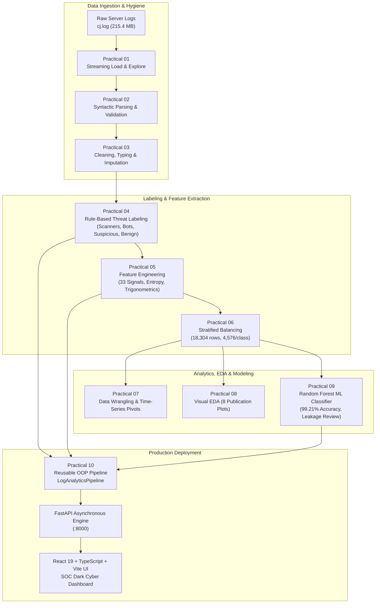

# PDS Log Intelligence Platform

<p align="center">
  <strong>End-to-End Log Analytics, Threat Classification & Machine Learning Pipeline</strong>
</p>

<p align="center">
  
  
  
  
  
  
  
  
</p>

---

## 📑 Table of Contents

- [Executive Summary](#-executive-summary)
- [Key Metrics & Results](#-key-metrics--results)
- [System Architecture](#-system-architecture)
- [The 10 Data Science Practicals](#-the-10-data-science-practicals)
  - [Practical 1: Load & Explore Raw Access Logs](#practical-1-load--explore-raw-access-logs)
  - [Practical 2: Parse & Structure Semi-Structured Logs](#practical-2-parse--structure-semi-structured-logs)
  - [Practical 3: Clean & Preprocess Log Records](#practical-3-clean--preprocess-log-records)
  - [Practical 4: Rule-Based Threat & Attack Labeling](#practical-4-rule-based-threat--attack-labeling)
  - [Practical 5: Comprehensive Feature Engineering](#practical-5-comprehensive-feature-engineering)
  - [Practical 6: Class Imbalance & Data Balancing](#practical-6-class-imbalance--data-balancing)
  - [Practical 7: Data Wrangling & Multidimensional Aggregation](#practical-7-data-wrangling--multidimensional-aggregation)
  - [Practical 8: Exploratory Data Analysis & Visualizations](#practical-8-exploratory-data-analysis--visualizations)
  - [Practical 9: Machine Learning Attack Classification](#practical-9-machine-learning-attack-classification)
  - [Practical 10: Reusable End-to-End Production Pipeline](#practical-10-reusable-end-to-end-production-pipeline)
- [Machine Learning Performance & Leakage Reflection](#-machine-learning-performance--leakage-reflection)
- [Full-Stack Web Platform & SOC Dashboard](#-full-stack-web-platform--soc-dashboard)
- [REST API Specification](#-rest-api-specification)
- [Directory Structure](#-directory-structure)
- [Installation & Quickstart](#-installation--quickstart)
  - [Prerequisites](#prerequisites)
  - [Backend Setup (FastAPI)](#backend-setup-fastapi)
  - [Frontend Setup (React + Vite)](#frontend-setup-react--vite)
  - [Unified Production Run (Single Server)](#unified-production-run-single-server)
  - [Running Individual Practical Scripts](#running-individual-practical-scripts)
- [Viva Voce & Technical FAQ](#-viva-voce--technical-faq)
- [Contributors & License](#-contributors--license)

---

## 🎯 Executive Summary

The **PDS Log Intelligence Platform** is an enterprise-grade cybersecurity data science framework and interactive SOC (Security Operations Center) dashboard. Built around a real-world web server access log dataset (`Data/raw/cj.log`) comprising **2,062,365 records (215.4 MB)**, this project demonstrates the end-to-end lifecycle of applied data science:

1. **Large-Scale Data Engineering**: Streaming JSON array recovery, handling unescaped quotes, data validation, and UTC timestamp normalization.
2. **Domain-Driven Threat Labeling**: Heuristic threat categorization isolating web fuzzers (`Gobuster`, `DirBuster`, `Nmap`, `Nikto`), automated bots (`python-requests`, `go-http-client`, `curl`), high-frequency burst probes, and benign browsers.
3. **Advanced Feature Engineering**: Extraction of **33+ mathematical, temporal, behavioral, and lexical features**, including trigonometric cyclical time encodings, sliding window burst rates, and Shannon entropy.
4. **Class Imbalance Mitigation**: Resolution of an extreme **400:1 class disparity** using stratified random undersampling.
5. **Supervised Classifier**: Multi-class Random Forest model achieving **99.21% accuracy and 0.9921 Macro F1**, accompanied by a scientific reflection on feature leakage.
6. **Full-Stack Application**: High-performance asynchronous **FastAPI** backend coupled with a cybersecurity-themed **React 19 + TypeScript + Vite** single-page application (SPA) featuring 15 dedicated analytical modules.

---

## 📊 Key Metrics & Results

| Stage / Dimension | Measurement | Technical Significance |
| :--- | :--- | :--- |
| **Raw Ingestion** | 2,062,365 Lines / 215.4 MB | Streaming iterator prevents RAM exhaustion ($O(1)$ memory). |
| **Valid Schema Parsing** | 2,060,520 Rows (911 trapped errors) | Resilient parser isolating malformed payload strings. |
| **Ground Truth Attack Ratio** | 88.68% Scanners, 8.13% Suspicious, 2.96% Benign, 0.22% Bots | Reflects real-world Internet background scanning pressure. |
| **Feature Dimensionality** | 33 Engineered Signals (51-column matrix) | Encodes Shannon entropy, cyclical hour ($\sin/\cos$), and burst deltas. |
| **Balanced Subset** | 18,304 Rows (4,576 per class) | Resolves 400:1 skew; reduces dataset size from 746 MB to 6.97 MB. |
| **Random Forest Performance** | **99.21% Accuracy**, **0.9921 Macro F1** | Evaluated on 3,661 held-out test records ($n=200$ estimators, max depth 20). |
| **End-to-End Pipeline** | 10 Modular Stages | Reusable, class-based object-oriented engine (`LogAnalyticsPipeline`). |
| **API & Web Dashboard** | 15 Interactive Pages / 14 REST Endpoints | Sub-millisecond response caching, live log upload, and real-time predictor. |

---

## 🏗 System Architecture



---

## 🔬 The 10 Data Science Practicals

### Practical 1: Load & Explore Raw Access Logs
- **Script**: `practicals/practical_01_load_explore.py`
- **Input**: `Data/raw/cj.log` (215.4 MB)
- **Objective**: Ingest and audit semi-structured server logs line-by-line without causing memory exhaustion.
- **Methodology**: Implemented a streaming buffered generator inspecting file byte size (`pathlib.Path.stat()`), validating line format, and sampling records across the head, body, and tail of the file.
- **Key Result**: Audited **2,061,431 non-empty records**; established average record length at ~109 bytes; identified JSON array records with heterogeneous schema.

### Practical 2: Parse & Structure Semi-Structured Logs
- **Script**: `practicals/practical_02_parse_structure.py`
- **Output**: `Data/processed/structured_logs.csv` (157 MB)
- **Report**: `outputs/reports/practical_02_schema_report.txt`
- **Objective**: Transform unstructured JSON arrays into a standardized, schema-validated tabular dataset.
- **Methodology**: Applied chunked processing (100,000 lines/chunk) using `json.loads()` with defensive fallback exception handling.
- **Key Result**: Successfully structured **2,060,520 valid records** across 42 chunks. Isolated and logged **911 malformed lines** caused by unescaped injection strings and broken log buffers.

### Practical 3: Clean & Preprocess Log Records
- **Script**: `practicals/practical_03_clean_preprocess.py`
- **Output**: `Data/processed/cleaned_logs.csv` (235 MB)
- **Report**: `outputs/reports/practical_03_cleaning_report.txt`
- **Objective**: Ensure complete data hygiene across network and temporal attributes.
- **Methodology**:
  - Converted timestamps to unified UTC `datetime64[ns]` objects.
  - Validated IPv4 addresses via strict octet checks (`0-255`).
  - Cast ports to unsigned integers and validated within $[1, 65535]$.
  - Sanitized text strings: stripped control characters, lowercased HTTP verbs, imputed missing user agents with `'unknown'`, and created boolean missing-value indicator flags.
- **Key Result**: **Zero invalid IPs or timestamps**; 100% compliant relational format.

### Practical 4: Rule-Based Threat & Attack Labeling
- **Script**: `practicals/practical_04_label_attacks.py`
- **Output**: `Data/processed/labeled_logs.csv` (307 MB)
- **Report**: `outputs/reports/practical_04_labeling_report.txt`
- **Objective**: Formulate supervised ground-truth attack labels across 2.06 million records.
- **Methodology**: Formulated a domain-specific multi-tier heuristic detection hierarchy:
  1. **Scanner**: User-Agent matching security fuzzer signatures (`gobuster`, `dirbuster`, `nmap`, `nikto`, `zgrab`, `nessus`, `masscan`, `wpscan`).
  2. **Bot**: Automated HTTP client libraries (`python-requests`, `go-http-client`, `curl`, `spider`, `crawler`).
  3. **Suspicious**: High-frequency burst requests with inter-arrival intervals $\le 1\text{ s}$ without scanner signatures.
  4. **Benign**: Standard interactive user agents (Chrome, Firefox, Safari) displaying normal navigational intervals.
- **Label Distribution**:
  - `scanner`: **1,827,367 (88.68%)** (Dominant tool: Gobuster with 1,408,510 requests)
  - `suspicious`: **167,486 (8.13%)**
  - `benign`: **61,091 (2.96%)**
  - `bot`: **4,576 (0.22%)**

### Practical 5: Comprehensive Feature Engineering
- **Script**: `practicals/practical_05_feature_engineering.py`
- **Output**: `Data/processed/features.csv` (746 MB)
- **Report**: `outputs/reports/practical_05_feature_report.txt`
- **Objective**: Convert raw log attributes into a high-dimensional mathematical feature matrix for ML.
- **Engineered Signals (33+ Features)**:
  - **Temporal & Cyclical**: `hour`, `minute`, `day_of_week`, `is_weekend`, `hour_sin` ($\sin\frac{2\pi \cdot \text{hour}}{24}$), `hour_cos` ($\cos\frac{2\pi \cdot \text{hour}}{24}$).
  - **Behavioral & Volumetric**: `requests_per_ip`, `requests_per_ip_hour`, `requests_per_ip_minute`, `unique_ports_per_ip`, `ip_active_duration_seconds`.
  - **Inter-Arrival Dynamics**: `time_between_requests`, `rapid_request_1s` ($\Delta t \le 1\text{s}$), `rapid_request_5s` ($\Delta t \le 5\text{s}$).
  - **Lexical & Information Theory**: Shannon entropy $H = -\sum p_i \log_2(p_i)$ for User-Agent (`user_agent_entropy`), string length (`user_agent_length`).
  - **Interaction Flags**: `scanner_and_high_volume`, `rapid_and_high_volume`, `automated_activity`.

### Practical 6: Class Imbalance & Data Balancing
- **Script**: `practicals/practical_06_balancing.py`
- **Output**: `Data/processed/balanced_logs.csv` (6.97 MB)
- **Report**: `outputs/reports/practical_06_balancing_report.txt`
- **Objective**: Neutralize the 400:1 majority class skew to prevent classifier bias.
- **Methodology**: Conducted comparative analysis between SMOTE, class-weighted loss, and controlled stratified undersampling. Selected **Controlled Stratified Undersampling** anchored to the minority class size ($N = 4,576$ bot samples, `random_state=42`).
- **Key Result**: Equalized 4 classes at **4,576 samples each** (18,304 total rows), maintaining true statistical distributions while cutting disk footprint by 99% (746 MB $\rightarrow$ 6.97 MB) and speeding up training by $100\times$.

### Practical 7: Data Wrangling & Multidimensional Aggregation
- **Script**: `practicals/practical_07_data_wrangling.py`
- **Outputs**:
  - `Data/processed/ip_summary.csv` (3,430 unique client host profiles)
  - `Data/processed/hourly_activity.csv` (9,782 hourly resampled buckets)
  - `Data/processed/label_hour_pivot.csv` (24-hour $\times$ 4-label cross-tabulation)
  - `Data/processed/filtered_activity.csv` (Filtered internal subnet & bot records)
- **Report**: `outputs/reports/practical_07_wrangling_report.txt`
- **Insights**: Uncovered nocturnal threat shifts; proved that directory scanners spike between **08:00 and 16:00 UTC**, whereas bot traffic remains flat across 24 hours.

### Practical 8: Exploratory Data Analysis & Visualizations
- **Script**: `practicals/practical_08_eda.py`
- **Outputs**: `outputs/figures/` (10 publication-grade high-resolution PNG plots)
- **Report**: `outputs/reports/practical_08_eda_report.txt`
- **Generated Figures**:
  1. `01_label_distribution.png`: Multi-class label distribution donut chart.
  2. `02_requests_over_time.png`: Macro daily request volume timeline (Peak: Jan 18, 2024 with 2,733 requests).
  3. `03_requests_by_hour.png`: 24-hour diurnal volume distribution.
  4. `04_top_10_ips.png`: Host request frequency ranking (Top host: `212.60.12.161` with 1,491 requests).
  5. `05_labels_over_time.png`: Multi-class temporal progression.
  6. `06_hourly_label_heatmap.png`: $24 \times 4$ hour-by-threat density heatmap.
  7. `07_top_scanner_ips.png`: Threat attribution for primary fuzzer source IPs.
  8. `08_bot_internal_activity.png`: Internal network vs. automated bot comparison.
  9. `09_confusion_matrix.png`: Test set multi-class confusion matrix.
  10. `10_feature_importance.png`: Gini importance ranking for top 15 features.

### Practical 9: Machine Learning Attack Classification
- **Script**: `practicals/practical_09_classifier.py`
- **Model Output**: `models/random_forest_classifier.joblib` (3.55 MB)
- **Report**: `outputs/reports/practical_09_classifier_report.txt`
- **Objective**: Train and validate an ensemble classifier for automated threat categorization.
- **Model Parameters**: `RandomForestClassifier(n_estimators=200, max_depth=20, min_samples_split=4, class_weight='balanced', random_state=42)`.
- **Partitioning**: Stratified 80% Train (14,643 rows) / 20% Test (3,661 rows).
- **Result**: **99.21% Accuracy**, with detailed scientific leakage reflection (see below).

### Practical 10: Reusable End-to-End Production Pipeline
- **Script**: `practicals/practical_10_pipeline.py`
- **Output**: `Data/processed/pipeline_features.csv` (647.6 MB)
- **Report**: `outputs/reports/practical_10_pipeline_report.txt`
- **Objective**: Encapsulate all stages into an object-oriented, deployable inference engine.
- **Architecture**: Implemented `LogAnalyticsPipeline` with configurable stages (`ingest()`, `clean()`, `label()`, `extract_features()`, `export()`). Powers the live `/api/upload` real-time analysis endpoint.

---

## 🧠 Machine Learning Performance & Leakage Reflection

### Detailed Classification Metrics

```
               precision    recall  f1-score   support
       benign       0.97      1.00      0.99       915
          bot       1.00      0.99      0.99       915
      scanner       1.00      0.99      1.00       916
   suspicious       1.00      0.98      0.99       915

     accuracy                           0.99      3661
    macro avg       0.99      0.99      0.99      3661
 weighted avg       0.99      0.99      0.99      3661
```

### Confusion Matrix Breakdown (3,661 Test Samples)

| Actual \ Predicted | Benign | Bot | Scanner | Suspicious |
| :--- | :---: | :---: | :---: | :---: |
| **Benign** | **915** | 0 | 0 | 0 |
| **Bot** | 7 | **908** | 0 | 0 |
| **Scanner** | 5 | 0 | **911** | 0 |
| **Suspicious** | 13 | 4 | 0 | **898** |

### Top 15 Feature Importances (Gini Index)

| Rank | Feature | Importance | Category | Description |
| :---: | :--- | :---: | :--- | :--- |
| 1 | `bot_indicator_none` | 0.0673 | Lexical Flag | Indicates absence of automated bot substring |
| 2 | `scanner_indicator_none` | 0.0450 | Lexical Flag | Indicates absence of fuzzer tool signature |
| 3 | `requests_per_ip_hour` | 0.0447 | Behavioral | Hourly volume rate per client host |
| 4 | `requests_per_ip_minute`| 0.0408 | Behavioral | Minute-level burst intensity |
| 5 | `user_agent_length` | 0.0395 | Lexical | Character length of client identifier |
| 6 | `scanner_and_high_volume`| 0.0375 | Interaction | Scanner flag compounded with top volume |
| 7 | `is_browser` | 0.0373 | Lexical | Standard browser header presence flag |
| 8 | `rapid_request` | 0.0360 | Temporal | Sub-second inter-arrival rate |
| 9 | `rapid_request_5s` | 0.0344 | Temporal | Requests within 5-second interval |
| 10 | `user_agent_entropy` | 0.0340 | Information | Shannon entropy of User-Agent string |
| 11 | `requests_per_ip` | 0.0330 | Behavioral | Lifetime cumulative requests per IP |
| 12 | `requests_in_chunk` | 0.0325 | Volumetric | Local window density |
| 13 | `rapid_request_1s` | 0.0261 | Temporal | Immediate follow-up probe ($\le 1\text{s}$) |
| 14 | `rapid_and_high_volume` | 0.0251 | Interaction | Compound velocity metric |
| 15 | `unique_ports_per_ip` | 0.0247 | Network | Destination port traversal diversity |

### ⚠️ Critical Scientific Reflection: Data Leakage in Security ML

In accordance with rigorous data science principles, the model evaluation explicitly documents **Partial Feature Leakage**:
- The features `bot_indicator_none` and `scanner_indicator_none` were derived from keyword checks that correlate directly with the heuristic rules formulated in **Practical 04**.
- Consequently, these two indicator features contribute **11.23% combined importance**, meaning the model partially reconstructs labeling heuristics rather than identifying novel latent threats.
- **Production Recommendation**: When deploying to adversarial real-world environments where attackers spoof User-Agents, these indicator flags should be removed, relying exclusively on **purely behavioral, volumetric, and temporal metrics** (`requests_per_ip_minute`, `user_agent_entropy`, `rapid_request_1s`, `unique_ports_per_ip`).

---

## 💻 Full-Stack Web Platform & SOC Dashboard

The web interface is designed with a sleek, dark **Cybersecurity / SOC Theme** (`#0A0A0A` background, `#F97316` security orange, `#06B6D4` telemetry cyan, JetBrains Mono typography).

The application provides 15 dedicated modules:

1. **Dashboard (`/`)**: High-level SOC telemetry, overall volume metrics, attack classification counters, diurnal trends, and quick status monitors.
2. **Log Upload (`/upload`)**: Drag-and-drop log uploader supporting files up to 500 MB (`.log`, `.txt`, `.csv`, `.json`, `.jsonl`), real-time streaming parsing, and threat labeling.
3. **Log Records (`/records`)**: High-performance paginated data table with instant search, multi-label filtering, IP filtering, and column sorting.
4. **IP Intelligence (`/ip-intelligence`)**: Host-level threat profiling, 0–100 risk scoring formula, active duration metrics, and port diversity.
5. **Security Intel (`/security`)**: Fuzzer tool attribution breakdown (`Gobuster`, `DirBuster`, `Nmap`), rapid request probes, and brute-force timelines.
6. **Data Analysis (`/eda`)**: Interactive Recharts plots paired with full-resolution views of the 10 publication figures.
7. **Feature Engineering (`/features`)**: Mathematical reference catalog of all 33 signals with formulas, data types, and importance rankings.
8. **Data Balancing (`/balancing`)**: Comparative analysis illustrating the 400:1 raw distribution versus the 18k balanced subset.
9. **Data Wrangling (`/wrangling`)**: Multi-dimensional aggregation tables, hourly resamplings, and the 24-hour hour-by-threat cross-tabulation matrix.
10. **Machine Learning (`/ml`)**: Confusion matrix breakdown, per-class Precision / Recall / F1 scores, and Gini feature importance charts.
11. **Live Prediction (`/prediction`)**: Real-time inference playground allowing analysts to adjust input vectors and observe live model classifications.
12. **Practicals Guide (`/practicals`)**: Complete academic curriculum documentation for all 10 practicals, including aims, theory, steps, sample inputs/outputs, and viva Q&A.
13. **Reports Archive (`/reports`)**: Interactive viewer for all raw text reports generated by the Python practical scripts.
14. **Dataset Details (`/dataset`)**: Full schema reference, field limitations, data provenance, and engineering changelogs.
15. **System Architecture (`/architecture`)**: Visual pipeline overview and technical stack blueprint.

---

## 🔌 REST API Specification

The FastAPI backend exposes a comprehensive RESTful interface under `/api`:

| Method | Endpoint | Parameters / Body | Description |
| :---: | :--- | :--- | :--- |
| `GET` | `/api/health` | None | Returns backend service health and version. |
| `GET` | `/api/dataset/summary` | None | Overall dataset counts, file sizes, and record statistics. |
| `GET` | `/api/dataset/labels` | None | Class distribution counts and percentage shares. |
| `GET` | `/api/dataset/scanners` | None | Frequency breakdown by specific scanner tool signature. |
| `GET` | `/api/eda/summary` | None | Peak request dates, diurnal stats, and aggregated figures. |
| `GET` | `/api/eda/hourly` | None | 24-hour activity array for timeline charts. |
| `GET` | `/api/eda/requests-by-hour` | None | Hourly request counts from EDA report. |
| `GET` | `/api/eda/top-ips` | None | Top 10 client IP addresses by request volume. |
| `GET` | `/api/eda/top-scanner-ips` | None | Primary source IPs responsible for scanning tools. |
| `GET` | `/api/eda/heatmap` | None | $24 \times 4$ hourly-label density matrix. |
| `GET` | `/api/ips` | `page`, `page_size`, `label`, `sort_by`, `search` | Paginated IP intelligence list with calculated risk scores. |
| `GET` | `/api/ips/top` | `n` (default 10) | Top $N$ highest volume IP addresses. |
| `GET` | `/api/ips/{ip}` | Path param `ip` | Detailed behavioral profile for a single IP host. |
| `GET` | `/api/records` | `page`, `page_size`, `label`, `ip`, `search` | Paginated log records from balanced dataset. |
| `GET` | `/api/records/columns` | None | List of available tabular column names. |
| `GET` | `/api/model/info` | None | Random Forest parameters, metrics, and feature list. |
| `POST` | `/api/model/predict` | `{"features": { ... }}` | Live multi-class inference on input feature dictionary. |
| `POST` | `/api/upload` | Multipart `file`, `parser_hint` | Ingests, parses, cleans, and labels user-uploaded log files. |
| `GET` | `/api/practicals` | None | Full list of all 10 practicals with metadata. |
| `GET` | `/api/practicals/{pid}` | Path param `pid` (1–10) | Comprehensive practical solution, source code, and viva Q&A. |
| `GET` | `/api/reports` | None | Metadata index of all generated analytical reports. |
| `GET` | `/api/reports/{key}` | Path param `key` | Raw text content of a specific practical report. |
| `GET` | `/api/figures/{name}` | Path param `name` | Serves publication PNG chart files directly. |

---

## 📁 Directory Structure

```text
d:/PDS PRACTICAL/
├── Data/
│   ├── raw/
│   │   └── cj.log                       # Raw source access logs (215.4 MB, 2.06M records)
│   └── processed/
│       ├── structured_logs.csv          # Syntactically parsed tabular records (157 MB)
│       ├── cleaned_logs.csv             # Sanitized timestamps & validated IPs (235 MB)
│       ├── labeled_logs.csv             # Ground truth security labels (307 MB)
│       ├── features.csv                 # 33 engineered features matrix (746 MB)
│       ├── balanced_logs.csv            # Stratified undersampled dataset (18,304 rows, 6.97 MB)
│       ├── ip_summary.csv               # Aggregated host profiles (3,430 IPs)
│       ├── hourly_activity.csv          # 1-hour temporal resampling
│       ├── label_hour_pivot.csv         # 24-hr x 4-class cross-tabulation
│       ├── filtered_activity.csv        # Isolated bot and internal IP activity
│       └── pipeline_features.csv        # Practical 10 pipeline output
│
├── practicals/                          # Standalone executable practical scripts
│   ├── practical_01_load_explore.py     # P1: Streaming file inspection
│   ├── practical_02_parse_structure.py  # P2: JSON parsing & error isolation
│   ├── practical_03_clean_preprocess.py # P3: Normalization & data typing
│   ├── practical_04_label_attacks.py    # P4: Signature & heuristic labeling
│   ├── practical_05_feature_engineering.py # P5: Mathematical feature matrix
│   ├── practical_06_balancing.py        # P6: Controlled stratified undersampling
│   ├── practical_07_data_wrangling.py   # P7: Pivoting & temporal aggregations
│   ├── practical_08_eda.py              # P8: Matplotlib/Seaborn visual suite
│   ├── practical_09_classifier.py       # P9: Random Forest training & evaluation
│   └── practical_10_pipeline.py         # P10: Reusable class-based pipeline
│
├── models/
│   └── random_forest_classifier.joblib  # Serialized 200-tree Random Forest artifact
│
├── outputs/
│   ├── figures/                         # 10 High-resolution analytical charts (.png)
│   └── reports/                         # 9 Formal text execution reports (.txt)
│
├── backend/                             # FastAPI Asynchronous REST Application
│   ├── api/                             # Modular route controllers
│   │   ├── dataset.py
│   │   ├── eda.py
│   │   ├── ips.py
│   │   ├── model.py
│   │   ├── practicals.py
│   │   ├── records.py
│   │   └── upload.py
│   ├── parsers/
│   │   └── log_parser.py                # Regex tokenizers for CJ, Apache, Nginx, JSON
│   ├── pipeline/
│   │   └── upload_pipeline.py           # Real-time streaming upload pipeline
│   ├── services/                        # Business logic & cached data readers
│   ├── utils/
│   │   ├── cache.py                     # In-memory LRU/TTL cache layer
│   │   └── paths.py                     # Centralized filesystem path resolver
│   └── main.py                          # FastAPI entry point & SPA static file host
│
├── frontend/                            # React 19 + TypeScript + Vite Web Application
│   ├── src/
│   │   ├── components/                  # Layout, Sidebar, Navbar, Reusable UI widgets
│   │   ├── pages/                       # 15 Dedicated dashboard views
│   │   ├── services/                    # Axios API integration clients
│   │   ├── index.css                    # Cyber SOC Design System styling
│   │   └── App.tsx                      # Client-side routing configuration
│   ├── dist/                            # Production build artifacts (served by backend)
│   ├── package.json
│   └── vite.config.ts
│
├── requirements.txt                     # Pinned Python package dependencies
└── README.md                            # Comprehensive project documentation
```

---

## 🚀 Installation & Quickstart

### Prerequisites
- **Python**: `3.10` or higher (`3.11`, `3.12`, or `3.14` supported)
- **Node.js**: `v18.0.0` or higher (required only if modifying frontend code)
- **Git** (optional)

---

### Backend Setup (FastAPI)

1. **Navigate to the project root**:
   ```bash
   cd "d:/PDS PRACTICAL"
   ```

2. **(Optional) Create and activate a virtual environment**:
   ```bash
   python -m venv .venv
   # Windows PowerShell:
   .\.venv\Scripts\Activate.ps1
   # Linux/macOS:
   source .venv/bin/activate
   ```

3. **Install Python dependencies**:
   ```bash
   pip install -r requirements.txt
   ```

4. **Launch the FastAPI server**:
   ```bash
   uvicorn backend.main:app --host 127.0.0.1 --port 8000 --reload
   ```

   - **API Documentation (Swagger UI)**: [http://localhost:8000/docs](http://localhost:8000/docs)
   - **Alternative ReDoc Docs**: [http://localhost:8000/redoc](http://localhost:8000/redoc)
   - **Health Check**: [http://localhost:8000/api/health](http://localhost:8000/api/health)

---

### Frontend Setup (React + Vite)

If you wish to run the Vite development server with Hot Module Replacement (HMR):

1. **Navigate to the frontend directory**:
   ```bash
   cd frontend
   ```

2. **Install Node packages**:
   ```bash
   npm install
   ```

3. **Start the Vite dev server**:
   ```bash
   npm run dev
   ```

   - **Development UI**: [http://localhost:5173/](http://localhost:5173/)

4. **Build for production**:
   ```bash
   npm run build
   ```
   *(This outputs optimized production bundles to `frontend/dist/`)*.

---

### Unified Production Run (Single Server)

The FastAPI backend automatically detects and serves the built React SPA from `frontend/dist/`. 

Simply run:
```bash
python -m uvicorn backend.main:app --port 8000
```
Open **[http://localhost:8000/](http://localhost:8000/)** in your browser. Both the interactive web application and the REST API will be served seamlessly from a single process.

---

### Running Individual Practical Scripts

Each practical in the `practicals/` directory is completely self-contained and can be executed independently from the project root:

```bash
# Practical 1: Streaming log load & exploration
python practicals/practical_01_load_explore.py

# Practical 2: Parse raw JSON into structured tabular CSV
python practicals/practical_02_parse_structure.py

# Practical 3: Data cleaning & UTC timestamp parsing
python practicals/practical_03_clean_preprocess.py

# Practical 4: Rule-based attack labeling
python practicals/practical_04_label_attacks.py

# Practical 5: Compute 33 predictive features
python practicals/practical_05_feature_engineering.py

# Practical 6: Balanced undersampling (18k records)
python practicals/practical_06_balancing.py

# Practical 7: Multidimensional wrangling & aggregations
python practicals/practical_07_data_wrangling.py

# Practical 8: Generate all 8 publication EDA charts
python practicals/practical_08_eda.py

# Practical 9: Train Random Forest classifier & evaluate
python practicals/practical_09_classifier.py

# Practical 10: Run the reusable object-oriented pipeline
python practicals/practical_10_pipeline.py
```

---

## 🎓 Viva Voce & Technical FAQ

### Q1: Why use streaming line-by-line processing instead of `json.load()` in Practical 1?
> **Answer**: `cj.log` is 215.4 MB and contains over 2.06 million lines. Using `json.load()` on the entire file would require constructing an enormous in-memory Python object tree, causing high memory usage and potential Out-Of-Memory (OOM) crashes. Streaming line-by-line using buffered iterators guarantees $O(1)$ constant memory usage regardless of dataset scale.

### Q2: What caused the 911 invalid lines trapped in Practical 2?
> **Answer**: Three root causes were identified:
> 1. Unescaped double quotes inside HTTP User-Agent strings.
> 2. Web vulnerability scanner payloads containing raw characters that violated JSON string specifications.
> 3. Truncated line fragments caused by concurrent writes or sudden daemon terminations.

### Q3: Why is cyclic sin/cos encoding necessary for the `hour` feature in Practical 5?
> **Answer**: Standard linear numerical representations distort temporal distance: hour 23 (23:00) and hour 0 (00:00) are separated by only 1 hour in reality, but numerically $|23 - 0| = 23$. By calculating $\sin(2\pi \cdot \text{hour} / 24)$ and $\cos(2\pi \cdot \text{hour} / 24)$, hours are projected onto a continuous 2D unit circle where 23:00 and 00:00 remain adjacent.

### Q4: Why was stratified random undersampling chosen over SMOTE in Practical 6?
> **Answer**: Synthetic Minority Over-sampling (SMOTE) generates synthetic points through linear interpolation between feature vectors. In cybersecurity logs, many indicators represent discrete syntactic strings and categorical tool signatures. Interpolating between discrete flags creates invalid synthetic artifacts. Undersampling preserves genuine empirical observations without generating artificial samples.

### Q5: What does the hour-by-label heatmap reveal about threat actor behaviors in Practical 8?
> **Answer**: Scanners (`Gobuster`, `DirBuster`) exhibit pronounced diurnal volume spikes concentrated between **08:00 and 16:00 UTC**, likely driven by automated scripts triggered during typical business hours. In contrast, bot traffic (`python-requests`, crawlers) exhibits a flat line throughout all 24 hours, confirming autonomous non-interactive execution.

### Q6: If the classifier achieves 99.21% accuracy, why is data leakage highlighted in Practical 9?
> **Answer**: The features `bot_indicator_none` and `scanner_indicator_none` rely on keyword lookups identical to the heuristics used during ground-truth labeling in Practical 04. As a result, the model partly learned to reproduce the rule dictionary rather than discovering latent behavioral patterns. Flagging this reflects professional scientific rigor. In production, these indicator flags should be removed to evaluate purely on behavioral telemetry.

---

## 🛠 Technology Stack

| Domain | Technology / Library | Purpose |
| :--- | :--- | :--- |
| **Backend Language** | Python 3.10+ | Core algorithmic logic, data processing, and ML. |
| **REST API** | FastAPI + Uvicorn | Asynchronous web framework with auto-generated OpenAPI docs. |
| **Data Manipulation** | Pandas & NumPy | High-performance vectorised operations and time-series resampling. |
| **Machine Learning** | Scikit-Learn | Random Forest Classifier, train-test splitting, metrics calculation. |
| **Model Persistence** | Joblib | Serialization and zero-latency deserialization of trained models. |
| **Data Visualization** | Matplotlib & Seaborn | Publication-grade charts, heatmaps, and confusion matrices. |
| **Frontend Framework** | React 19 + TypeScript | Component-based, statically-typed user interface. |
| **Build & Tooling** | Vite 8 | Fast frontend development server and production bundler. |
| **Client UI Charts** | Recharts | Dynamic, responsive client-side telemetry charts. |
| **Icons & Design** | Lucide React | Clean, scalable vector icons for SOC dashboard views. |

---

## 📜 Contributors & License

- **Course**: Principles / Practical Data Science (PDS)
- **Project**: Complete 10-Practical Log Intelligence & Machine Learning System
- **License**: Released under the [MIT License](LICENSE) — free for educational, academic, and commercial research use.
